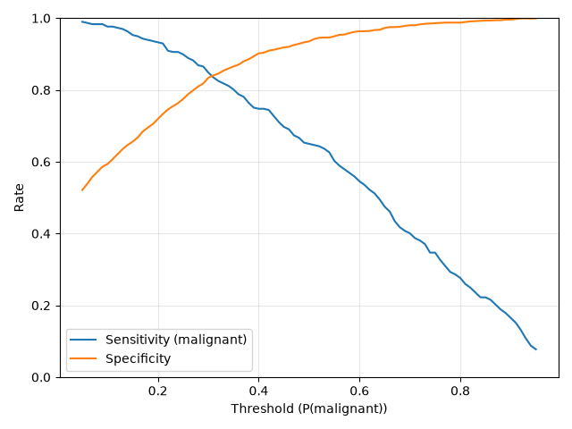
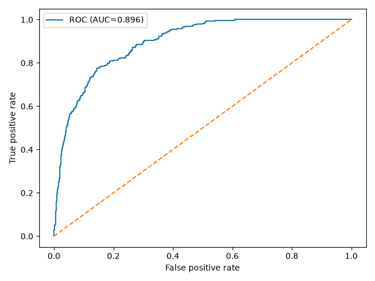
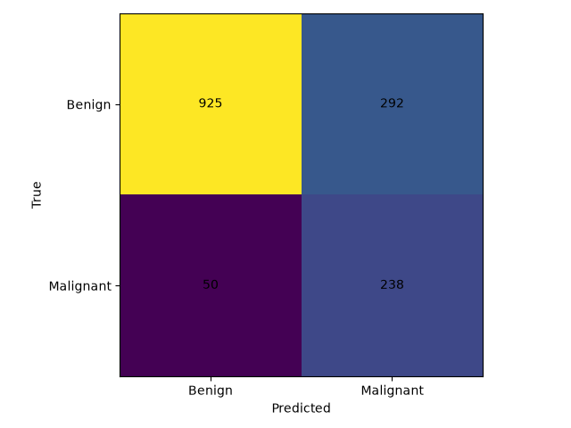
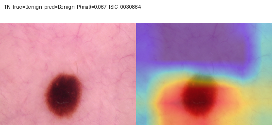

# Skin Lesion Classifier

Educational binary classification of HAM10000 dermoscopic images using **PyTorch**, **MobileNetV2** transfer learning, **Grad-CAM**, and a **Streamlit** demo.

This is a computer-vision / ML portfolio project, **not a medical device**. It does not diagnose melanoma or any other disease.

## Overview

HAM10000 is a seven-class diagnostic dataset. This repository trains a two-class MobileNetV2 (benign vs a project-defined positive class), selects an operating threshold on **validation only**, and reports a single locked held-out **test** evaluation.

## Dataset

[HAM10000](https://doi.org/10.1038/sdata.2018.161): **10,015** images, **7,470** unique lesions, **seven** original `dx` categories.

| dx | count | name |
|---|---|---|
| nv | 6705 | melanocytic nevus |
| mel | 1113 | melanoma |
| bkl | 1099 | benign keratosis-like |
| bcc | 514 | basal cell carcinoma |
| akiec | 327 | actinic keratosis / intraepithelial carcinoma |
| vasc | 142 | vascular lesion |
| df | 115 | dermatofibroma |

HAM10000 **does not** provide an official binary benign/malignant label. The grouping below is an **experimental modeling choice for this project**:

- **0 Benign:** `nv`, `bkl`, `df`, `vasc`
- **1 Positive / “malignant” class:** `mel`, `bcc`, `akiec`

`akiec` combines actinic keratoses and intraepithelial carcinoma (Bowen's disease). Grouping it with the positive class is a simplification. It does **not** mean every actinic keratosis is equivalent to invasive malignancy.

Images live locally in `data/ham10000/` (gitignored). Do not commit the raw dataset.

## Leakage-safe splits

Many lesions have multiple images (1,956 lesions have more than one). An image-level split can put the same lesion in train and test.

Splits are **lesion-level**, seed **42**, with **no lesion or image ID overlap**.

| split | images | lesions | benign | positive |
|---|---|---|---|---|
| train | 7,010 | 5,229 | 5,641 | 1,369 |
| validation | 1,500 | 1,120 | 1,203 | 297 |
| test | 1,505 | 1,121 | 1,217 | 288 |

Manifests: `data/splits/{train,val,test}.csv`. Training does not regenerate them.

## Class imbalance

Train set ≈ **4.12:1** benign:positive (5,641 / 1,369). Weighted cross-entropy used train-only balanced weights: **benign 0.6213**, **positive 2.5603**. Accuracy alone is a poor summary because a majority-benign classifier can look strong without detecting the positive class.

## Model

- torchvision **MobileNetV2**, ImageNet-pretrained
- input **224×224**, ImageNet mean/std
- classifier: `Dropout(0.2)` + `Linear(last_channel, 2)`

Transfer learning: reuse ImageNet convolutional features, then adapt the head (and later the full net) to this binary task.

## Experiment 1 — frozen backbone

Feature extractor frozen; classifier trained (2,562 / 2,226,434 parameters). Best **validation** ROC-AUC ≈ **0.876**. This is the transfer-learning baseline.

```bash
python -m skinlesion.train --experiment frozen
```

Saves `artifacts/mobilenetv2_frozen_baseline.pth` (never overwrites the legacy archive checkpoint).

## Experiment 2 — fine-tuning

Initialized from the frozen baseline; entire MobileNetV2 unfrozen; lower learning rate on the backbone; early stopping on validation ROC-AUC. Best **validation** ROC-AUC **0.921946**. Fine-tuning improved validation discrimination relative to the frozen baseline (no formal significance test).

```bash
python -m skinlesion.train \
  --experiment finetune \
  --init-checkpoint artifacts/mobilenetv2_frozen_baseline.pth
```

Saves `artifacts/mobilenetv2_finetuned.pth`.

## Threshold selection (validation only)

The displayed class is **not** argmax / 0.50. Thresholds were compared on **validation** before the test set was used.

| rule | threshold | sensitivity | specificity |
|---|---|---|---|
| default 0.50 | 0.50 | 0.650 | 0.935 |
| max F1 | 0.42 | 0.744 | 0.909 |
| Youden J and ≥85% sensitivity (max spec) | **0.29** | 0.865 | 0.818 |
| ≥90% sensitivity (max spec) | 0.24 | 0.906 | 0.763 |

**Locked threshold: 0.29** (malignant if \(P(\text{malignant}) \ge 0.29\)).

```bash
python -m skinlesion.threshold --checkpoint artifacts/mobilenetv2_finetuned.pth
```



## Final held-out test results

Reporting-only evaluation of `artifacts/mobilenetv2_finetuned.pth` at threshold **0.29** on `data/splits/test.csv`. The threshold was **not** retuned on test.

n = **1,505** (1,217 benign, 288 positive)

| Metric | Value |
|---|---|
| ROC-AUC | 0.896 |
| Accuracy | 0.773 |
| Balanced accuracy | 0.793 |
| Sensitivity | 0.826 |
| Specificity | 0.760 |
| Precision (positive) | 0.449 |
| F1 (positive) | 0.582 |

Confusion matrix: TN **925**, FP **292**, FN **50**, TP **238**.

95% bootstrap CIs (1,000 resamples, seed 42): ROC-AUC **0.877–0.913**; sensitivity **0.782–0.867**; specificity **0.736–0.784**.

```bash
python -m skinlesion.final_test
```





## Grad-CAM

Grad-CAM highlights spatial regions that influenced a **selected class logit** (the displayed predicted class). It does **not** identify cancerous tissue or establish clinically meaningful reasoning.

Example on an in-distribution HAM10000 training image (illustrative only):



## Project structure

```
SkinLesionClassifier/
├── streamlit_app.py
├── skinlesion/          # data, model, train, eval, inference, Grad-CAM
├── artifacts/           # checkpoints (see Git note below)
├── data/ham10000/       # local dataset, gitignored
├── data/splits/         # lesion-level CSV manifests
├── outputs/             # run logs and plots, gitignored
├── docs/images/         # figures embedded in this README
├── requirements.txt
├── Dockerfile
└── README.md
```

## Run locally

```bash
cd SkinLesionClassifier
python3 -m venv .venv
source .venv/bin/activate          # Windows: .venv\Scripts\activate
pip install -r requirements.txt
streamlit run streamlit_app.py
```

The demo expects `artifacts/mobilenetv2_finetuned.pth`. If that file is missing from a clone, training (or copying the checkpoint) is required; `pip install` + `streamlit run` is not enough without weights.

HAM10000 is not in Git. Place it at `data/ham10000/` to retrain or inspect diagnostics.

## Tech stack

Python, PyTorch, torchvision, scikit-learn, pandas, NumPy, Pillow, Matplotlib, Streamlit, tqdm.

## Limitations

- Binary reduction of a seven-class dataset; experimental class mapping (including `akiec`).
- Class imbalance and moderate positive-class precision on test (many false positives at the locked threshold).
- Trained only on HAM10000 dermoscopy; no external dataset or clinical validation.
- Grad-CAM is an attribution visualization, not medical localization.
- False positives and false negatives both occur; educational/research use only.

## License / data

HAM10000 has its own terms. This project is for education and research demonstration.
